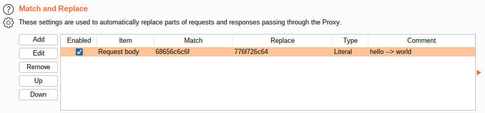
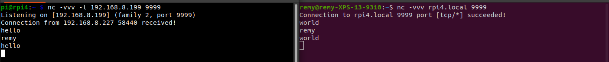

# BitSlinger: The TCP/UDP Packet Payload Editing Tool

The aim of this tool is to address pain points in editing the payloads of TCP/UDP packets for use in fuzzing, exploit development, and general tomfoolery. This is accomplished by handling all of the nasty complicated bits and presenting the end-user with the ability to easily connect bitslinger to a modifying proxy.

Bitslinger supports both HTTP proxies as well as WebSocket proxies. For example, running `bitslinger` will default to attempting to use an HTTP proxy at `127.0.0.1:8080`, which is the default listening port for the popular [Burp Suite](https://portswigger.net/burp/communitydownload) tool.

Burp Suite will see a request like the following:
```
POST /bitslinger HTTP/1.1
Host: 127.0.0.1:9393
User-Agent: Go-http-client/1.1
Content-Length: 12
Packet-Uuid: 96f7ba66-d3f2-4b06-b6a0-e5975525d98f

68656c6c6f0a
```

`68656c6c6f0a` is is the hex encoded payload of a packet that was intecepted. If we decode the hex, we find that the packet is simply the string `"hello\n"`.

In Burp Suite, we can manually edit and forward the packet or even set a configuration option to automatically replace instances of `68656c6c6f` with `776f726c64` ("world") in an existing TCP Connection.





This is a very simple example of text based replacement with a GUI tool, but bitslinger also supports websockets through the use of the `--ws` flag. In the `examples` directory of this repo you will find barebones examples of how to write programmatic interfaces for bitslinger using various code languages like Go, Python, and Nodejs.

Any code language that can interact with websockets can be used to edit TCP/UDP packets using bitslinger.

# How it works

There are 3 primary components of a bitslinger workflow:

1. Routing
2. Exposing packets through a user friendly interface
3. Packet Editing

## 1. Routing

Routing is handled using `iptables` commands. You can find examples of simple wrapper scripts for TCP/UDP interception in the `iptables_utils` folder of this repo. The general concept is that an iptables rule is set that routes packets into a [netfilter queue](https://netfilter.org/projects/libnetfilter_queue/).
```
iptables -t raw -A PREROUTING -p udp --source-port 8080 -j NFQUEUE --queue-num 0
```

The above command instructs your system to place UDP packets with a source port of 8080 into a netfilter queue #0.

Packets do not leave a queue unless programmatically released.

## 2. Exposing packets through a user friendly interface

Bitslinger attaches to the netfilter queue ID (Default 0, but can be specified with `--qnum` flag) and exposes an interface using HTTP or WebSockets.

When a new packet appears in the queue, bitslinger generates a universally unique identifier (UUID) to tag that packet and encodeds the packet's payload data as hex. The UUID and hex encoded payload is formatted as a easily parsable syntax depending on the proxy intefeact mode specified.

### HTTP Proxy

In this mode bitslinger will automatically stand up an HTTP listener in this mode and attempt to send and receive packets through the configured HTTP proxy (Default 127.0.0.1:8080, but can be specified with `--proxy`) such as Burp Suite, mitmproxy, Telerik Fiddler, etc...

The format of the HTTP requests is as follows:

UUID is placed in the HTTP header `Packet-Uuid`. **Do not alter this value, it is used for tracking purposes.**

EX: `Packet-Uuid: 96f7ba66-d3f2-4b06-b6a0-e5975525d98f`

The hex encoded packet payload is placed in the HTTP body.

EX `68656c6c6f0a`

An HTTP `POST` request is sent through the proxy and back to the bitslinger HTTP listener (Default 127.0.0.1:9393, but can be configured with `--server` flag) where the packet may be reconstructed and forwarded.

### WebSocket Proxy

In this mode bitslinger will automatically stand up a WebSocket server in this mode and attempt to send and receive messages containing the packets in the following format to any connected 
WebSocket client.

EX: `96f7ba66-d3f2-4b06-b6a0-e5975525d98f\n68656c6c6f0a\n`

Where the UUID and hex encoded payloads segments are terminated with a Line-Feed `\n`.

### No Proxy

**In the event that there is no available HTTP proxy or WebSocket client to receive packet payloads, bitslinger will default to "fail open" and allow all packets to pass through without interference.** If an HTTP Proxy or WebSocket Client becomes available while bitslinger is running, it will automatically being routing packets through the proxy again.

This is one of bitslingers most important features and allows for rapid development of tooling to modify protocols without the need to setup/teardown a networking setup on each iteration in the development cycle.

## 3. Packet Editing

This is the part you, the end-user handle.

Whether you want you just poke around manually using Burp Suite or write a custom [Kaitai Struct](https://kaitai.io/) protocol parser on top of the websocket client examples from the `/examples` directory of this repo, it's entirely up to you and not limited by code language.

# Building + Quick Start

    Tested on Ubuntu 20.04

Requirements:
* Go 1.16+
* Development headers
* * `apt install libnetfilter-queue-dev`


Clone the repo:

`git clone https://github.com/xen0bit/bitslinger.git`

Enter the directory:

`cd bitslinger`

Build the binary:

`go build`

*Optional:*

If you have a correctly configured `$GOPATH` you can run `go install` to make `bitslinger` available as command in any terminal window.

```
BitSlinger: The TCP/UDP Packet Payload Editing Tool
Usage of ./bitslinger:
      --proxy string    host:port pair for HTTP Proxy based modifications. (default "127.0.0.1:8080")
      --qnum int        NFQueue queue number to attach to.
      --server string   host:port pair for bitslinger (http:// or ws://) listener (default "127.0.0.1:9393")
      --verbose         Verbose logging. May slow down operation, but useful for debugging.
      --ws              Configures the packet encapsulation to use websockets
```